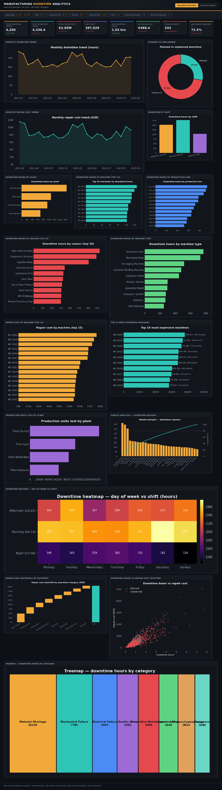
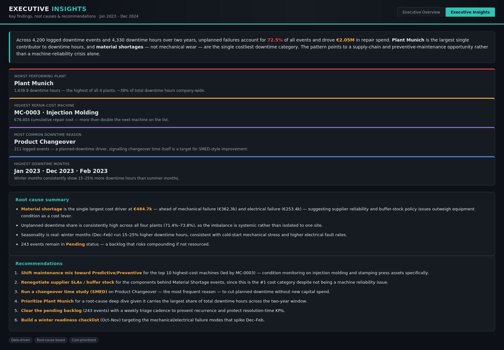

<div align="center">

# 🏭 Manufacturing Downtime Analytics

### An end-to-end Power BI analytics project turning 4,200 shop-floor downtime events into executive decisions

[](https://YOUR-USERNAME.github.io/manufacturing-downtime-analytics/)
[](docs/Data_Model.md)
[](#-license)


**[🔗 Live Dashboard](https://YOUR-USERNAME.github.io/manufacturing-downtime-analytics/)** · **[📊 Executive Insights](https://YOUR-USERNAME.github.io/manufacturing-downtime-analytics/#insights)** · **[📁 Data Model](docs/Data_Model.md)** · **[🧮 DAX Measures](dax/DAX_Measures.md)**

</div>

---

> **Update the two `YOUR-USERNAME` links above once you enable GitHub Pages** (Settings → Pages → Deploy from branch → `main` / root). `index.html` is already built to serve directly from the repo root — no build step required.

## 📸 Preview

<table>
<tr>
<td width="50%"></td>
<td width="50%"></td>
</tr>
<tr>
<td align="center"><sub><b>Page 1 — Executive Overview</b>: KPIs, trends, and 13 drill-down visuals</sub></td>
<td align="center"><sub><b>Page 2 — Executive Insights</b>: findings, root causes, and recommendations</sub></td>
</tr>
</table>

---

## 📋 Table of Contents

- [Overview](#-overview)
- [Why This Project](#-why-this-project--business-value)
- [Key Features](#-key-features)
- [Key Findings](#-key-findings)
- [Technology Stack](#-technology-stack)
- [Project Structure](#-project-structure)
- [Getting Started](#-getting-started)
  - [Option A — View the live dashboard](#option-a--view-the-live-html-dashboard-fastest)
  - [Option B — Build the real .pbix in Power BI Desktop](#option-b--build-the-real-pbix-in-power-bi-desktop-15-30-min)
  - [Option C — Regenerate the dataset from scratch](#option-c--regenerate-the-dataset-from-scratch)
- [Data Model](#-data-model)
- [DAX Measures](#-dax-measures)
- [Dashboard Design](#-dashboard-design)
- [Challenges & Solutions](#-challenges--solutions)
- [Lessons Learned](#-lessons-learned)
- [Roadmap](#-roadmap)
- [Contributing](#-contributing)
- [FAQ](#-faq)
- [License](#-license)
- [Acknowledgements](#-acknowledgements)

---

## 🧭 Overview

**Manufacturing Downtime Analytics** is a portfolio-grade business intelligence project built to demonstrate the full workflow of a **Data Analyst / BI Developer**: from raw synthetic data generation, through dimensional modeling and DAX, to a polished, recruiter-ready executive dashboard.

The project simulates two years (Jan 2023 – Dec 2024) of downtime logging across **4 plants**, **12 production lines**, and **47 machines**, then answers the questions a plant operations director actually asks:

- *Where* is downtime concentrated — which plant, line, machine, shift?
- *Why* is it happening — mechanical failure, material shortage, changeover, operator error?
- *What* is it costing us — in euros and in lost production units?
- *What* should we do about it — in priority order?

Because the dataset is synthetic, the project ships **everything needed to reproduce it and rebuild the real `.pbix`** in Power BI Desktop in under 30 minutes — see [Getting Started](#-getting-started).

## 💼 Why This Project / Business Value

Unplanned downtime is one of the most expensive and most measurable problems in manufacturing. This project is designed to mirror a real consulting/analyst engagement:

| Business question | Where it's answered |
|---|---|
| Which plant needs the most attention? | KPI cards + "Downtime hours by plant" chart |
| Is downtime a maintenance problem or a supply-chain problem? | Root-cause treemap + waterfall by category |
| Which machines are draining the maintenance budget? | "Top 10 most expensive machines" chart |
| Is downtime seasonal, and should staffing/spares planning change? | Monthly trend + day-of-week × shift heatmap |
| What should leadership act on first? | Executive Insights page — 6 prioritized recommendations |

The **Executive Insights** page exists specifically because dashboards without a narrative rarely drive action — it forces the analysis into decisions a plant manager can execute this quarter.

## ✨ Key Features

- 🗂️ **Realistic synthetic dataset** — 4,200 events with correlated, non-random patterns (seasonality, machine-type failure tendencies, shift effects) rather than pure noise, generated reproducibly with `numpy`/`pandas`.
- ⭐ **Proper star schema** — `Fact_Downtime` related to `Dim_Date` and `Dim_Machine`, not a single flat table, so the model performs and scales the way a real BI model should ([details](docs/Data_Model.md)).
- 🧮 **23 production-ready DAX measures** — base aggregations, `CALCULATE` filter-context measures, YoY time intelligence, `RANKX`, and Pareto cumulative-% logic, ready to paste into Power BI ([full list](dax/DAX_Measures.md)).
- 📊 **17 chart types on one page** — trend lines, donuts, bar/column, Pareto, heatmap, waterfall, scatter, and treemap — covering the visual vocabulary a BI developer is expected to know.
- 🎯 **Two-page executive narrative** — an at-a-glance KPI/chart overview *and* a findings-and-recommendations page, matching how real stakeholders consume BI (skim, then decide).
- 🌗 **"Dark Industrial" design system** — a deliberate, documented dark theme (hex tokens, KPI conditional-formatting rules) built to look like plant-floor signage, not a generic BI template ([spec](docs/Dashboard_Design.md)).
- ♿ **Accessible, responsive HTML preview** — the dashboard mockup is a real, semantic, keyboard-navigable web page (see [Getting Started](#option-a--view-the-live-html-dashboard-fastest)), not just a static screenshot.
- 🔁 **Fully reproducible** — two scripts regenerate the dataset and every chart from scratch with one command each.

## 🔑 Key Findings

| Finding | Detail |
|---|---|
| 🔴 **Unplanned downtime dominates** | 72.5% of all events are unplanned — well above a healthy ~50–60% benchmark |
| 🏭 **Plant Munich is the outlier** | Largest share of total downtime hours (~38%) of the 4 plants |
| 💶 **Material shortage, not machines, drives cost** | €484.7k — the single largest repair-cost category, ahead of mechanical (€362.3k) and electrical (€253.4k) failure — a supply-chain signal, not a pure maintenance one |
| 🔧 **Changeover is the most frequent reason** | 211 logged events — a strong candidate for a SMED-style time study |
| ❄️ **Winter months run hot** | Dec–Feb downtime hours run 15–25% above summer months |
| ⏳ **A growing backlog** | 243 events are still in `Pending` status |

Full write-up, root-cause notes, and six prioritized recommendations: [`docs/Executive_Insights.md`](docs/Executive_Insights.md).

## 🛠️ Technology Stack

| Layer | Tools |
|---|---|
| **BI platform** | Power BI Desktop (data model, DAX, report pages) |
| **Data generation** | Python 3, `pandas`, `numpy` |
| **Chart rendering** (for the HTML preview) | Python, `matplotlib` |
| **Dashboard preview** | Semantic HTML5, CSS Grid/Flexbox, vanilla JavaScript (no frameworks, no build step) |
| **Data formats** | CSV, XLSX (multi-sheet star schema workbook) |
| **Docs** | Markdown |

No compilers, bundlers, or package managers are required to *view* the project — everything renders in a browser or in Power BI Desktop directly.

## 🗃️ Project Structure

```
manufacturing-downtime-analytics/
├── index.html                     # ⭐ Live dashboard entry point (GitHub Pages root)
├── charts/                        # 17 chart PNGs used by index.html
├── dashboard/
│   ├── page1_executive_dashboard.html   # Standalone source mockup — Page 1
│   ├── page2_executive_insights.html    # Standalone source mockup — Page 2
│   └── kpis.json                        # Computed KPI values powering both mockups
├── data/
│   ├── manufacturing_downtime_data.csv      # Flat export, 4,200 rows
│   ├── manufacturing_downtime_data.xlsx     # 3-sheet workbook: Fact_Downtime, Dim_Date, Dim_Machine
│   ├── dim_date.csv                         # Standalone date dimension
│   └── dim_machine.csv                      # Standalone machine dimension
├── dax/
│   └── DAX_Measures.md            # All 23 DAX measures, ready to paste into Power BI
├── docs/
│   ├── Data_Model.md              # Star schema, relationships, setup steps
│   ├── Dashboard_Design.md        # KPI/visual/slicer spec for both report pages + theme tokens
│   ├── DAX_and_KPI_Explained.md   # Plain-English walkthrough of what each measure means
│   └── Executive_Insights.md      # Findings & business recommendations (source for page 2)
├── screenshots/
│   ├── executive_overview.png
│   └── executive_insights.png
├── scripts/
│   ├── generate_data.py           # Builds the fact table (CSV + XLSX), seeded for reproducibility
│   └── build_charts.py            # Computes KPIs + generates the 17 chart images from the data
├── LICENSE
└── README.md
```

## 🚀 Getting Started

### Option A — View the live HTML dashboard (fastest)

No installation needed.

1. **Live demo:** open the [hosted dashboard](https://YOUR-USERNAME.github.io/manufacturing-downtime-analytics/) (enable GitHub Pages once — see note under the badges above).
2. **Or run it locally:**
   ```bash
   git clone https://github.com/YOUR-USERNAME/manufacturing-downtime-analytics.git
   cd manufacturing-downtime-analytics
   open index.html        # macOS
   # start index.html      # Windows
   # xdg-open index.html   # Linux
   ```
   Or serve it (recommended for correct relative-path loading in all browsers):
   ```bash
   python3 -m http.server 8000
   # then visit http://localhost:8000
   ```
3. Use the **Executive Overview** / **Executive Insights** tabs at the top to switch pages — fully keyboard-navigable (arrow keys move between tabs, `Enter`/`Space` activates).

### Option B — Build the real `.pbix` in Power BI Desktop (15–30 min)

This repo does not ship a `.pbix` binary — Power BI's file format can only be authored inside Power BI Desktop — but everything needed to build it is provided:

1. Open **Power BI Desktop → Get Data →** import `data/manufacturing_downtime_data.xlsx`.
2. Follow [`docs/Data_Model.md`](docs/Data_Model.md) to build the relationships and mark the date table.
3. Paste the measures from [`dax/DAX_Measures.md`](dax/DAX_Measures.md) into a new `_Measures` table.
4. Follow [`docs/Dashboard_Design.md`](docs/Dashboard_Design.md) to lay out the two report pages — every KPI card, chart, and slicer is specified with the exact field to use, plus the full color/theme spec.
5. Use `screenshots/` as the finished target to match layout and theme.

### Option C — Regenerate the dataset from scratch

Requires Python 3.9+, `pandas`, `numpy`, and `matplotlib`.

```bash
pip install pandas numpy matplotlib openpyxl
cd scripts
python3 generate_data.py      # builds the fact table (CSV + XLSX), seeded with numpy's default_rng(42)
python3 build_charts.py       # computes KPIs + regenerates all 17 chart images from the data
```

## 🗂️ Data Model

Star schema: `Fact_Downtime` (4,200 rows, one row per downtime event) related **1 : many** to `Dim_Date` (on `Date`) and `Dim_Machine` (on `Machine ID`, which also carries `Plant` / `Production Line` / `Machine Type`).

| Column group | Fields |
|---|---|
| Calendar | Date, Year, Month, Week |
| Asset hierarchy | Plant, Production Line, Machine ID, Machine Type |
| People | Shift, Operator ID, Technician |
| What happened | Downtime Category, Downtime Reason, Root Cause, Planned or Unplanned |
| Impact | Downtime Minutes/Hours, Repair Cost (EUR), Cost per Minute, Production Units Lost |
| Status | Status (Resolved/Pending/In Progress), Resolution Time, Maintenance Type (Corrective/Preventive/Predictive) |

Full diagram, relationship setup, and modeling assumptions: [`docs/Data_Model.md`](docs/Data_Model.md).

**Dataset scope:** 4 plants (Rotterdam, Munich, Katowice, Lyon) · 12 production lines · 47 machines across 10 machine types · 8 downtime categories with 3–5 specific reasons each · 3 shifts · 120 operators · 25 technicians · 6 product types.

## 🧮 DAX Measures

23 measures covering volume, cost, production impact, planned/unplanned split, resolution and status, YoY time intelligence, Pareto cumulative %, and conditional-formatting color helpers. Highlights:

```dax
Total Downtime Events   = COUNTROWS ( Fact_Downtime )
Total Downtime Hours    = SUM ( Fact_Downtime[Downtime Hours] )
Total Repair Cost       = SUM ( Fact_Downtime[Repair Cost EURO] )
Unplanned Downtime %    =
    DIVIDE (
        CALCULATE ( [Total Downtime Events], Fact_Downtime[Planned or Unplanned] = "Unplanned" ),
        [Total Downtime Events]
    )
```

Full DAX and plain-English explanations: [`dax/DAX_Measures.md`](dax/DAX_Measures.md) and [`docs/DAX_and_KPI_Explained.md`](docs/DAX_and_KPI_Explained.md).

## 🎨 Dashboard Design

**Page 1 — Executive Overview**: 8 KPI cards, slicers for date / plant / line / machine / machine type / shift / downtime category / planned-vs-unplanned, and 13 visuals — monthly downtime and cost trends, downtime by plant/machine/line/shift/reason/machine type, planned-vs-unplanned donut, repair cost by machine, top 10 most expensive machines, units lost by plant, a Pareto chart, a day × shift heatmap, a cost waterfall, a downtime-vs-cost scatter, and a category treemap.

**Page 2 — Executive Insights**: narrative summary, 4 headline findings, root-cause notes, and a prioritized recommendations list.

**Theme — "Dark Industrial"**: a documented dark palette (background `#0D1117`, panels `#161B22`, amber/teal/red/blue/purple/green accents) designed to evoke plant-floor signage rather than a generic dashboard template. Full token table, typography rules, and KPI conditional-formatting logic in [`docs/Dashboard_Design.md`](docs/Dashboard_Design.md).

## 🧩 Challenges & Solutions

| Challenge | Solution |
|---|---|
| Synthetic data that "feels real" instead of uniform random noise | Modeled seasonality (winter cold-start effects), machine-type-specific failure tendencies, and shift/day patterns directly into the generator rather than sampling everything independently |
| A flat CSV export doesn't demonstrate real BI modeling skill | Pre-split the data into a proper star schema (`Fact_Downtime` + `Dim_Date` + `Dim_Machine`) shipped as a 3-sheet workbook, with the relationship/setup steps documented |
| No `.pbix` can be authored outside Power BI Desktop | Shipped a fully-specified build path (data model doc + DAX file + dashboard spec) so anyone can produce the exact `.pbix` in under 30 minutes, rather than shipping an unreviewable binary |
| Dashboards with charts but no narrative rarely drive decisions | Added a second "Executive Insights" page that converts every chart-level finding into a root cause and a prioritized, ownable recommendation |
| Static dashboard screenshots don't demonstrate front-end/UX ability | Built the dashboard mockup as a real, accessible, responsive, keyboard-navigable HTML page — not just an image |

## 📚 Lessons Learned

- **Modeling discipline pays off even in a portfolio project.** Building the star schema first (rather than reporting off a flat table) made every DAX measure simpler and made the project defensible in an interview.
- **A narrative page changes how a dashboard reads.** Charts alone invite browsing; a findings-and-recommendations page invites decisions — the difference between "here's the data" and "here's what to do."
- **Synthetic data still needs a point of view.** Injecting believable seasonality and category-specific cost skew made the "key findings" genuinely discoverable from the data, rather than pre-scripted.
- **Accessibility and responsiveness are part of "done."** A dashboard mockup that only works at one viewport width, with no keyboard support, undersells the rest of the analysis — these were fixed as first-class requirements, not an afterthought.

## 🗺️ Roadmap

- [ ] Ship the authored `.pbix` file once repeatedly validated in Power BI Desktop
- [ ] Add a `dim_date.csv`/`dim_machine.csv`-only "lite" model for learners who want to build the star schema themselves from flat files
- [ ] Add row-level security (RLS) example for plant-level access control
- [ ] Add a Python/Streamlit alternative front end as a second way to explore the dataset
- [ ] Add unit tests for `generate_data.py`'s statistical properties (seasonality, category distributions)
- [ ] Publish a short write-up/case-study version for LinkedIn

Have an idea? Open an issue — see [Contributing](#-contributing).

## 🤝 Contributing

Contributions, suggestions, and issue reports are welcome.

1. Fork the repository
2. Create a feature branch: `git checkout -b feature/my-improvement`
3. Commit your changes: `git commit -m "Add my improvement"`
4. Push to your branch: `git push origin feature/my-improvement`
5. Open a Pull Request describing what changed and why

Please keep the synthetic-data generation reproducible (seeded RNG) and keep the dashboard dependency-free (no new frameworks/build steps) unless discussed in an issue first.

## ❓ FAQ

**Is this real manufacturing data?** No — it's synthetic data generated with a seeded RNG (`numpy.random.default_rng(42)`) to be realistic but reproducible and shareable without any confidentiality concerns.

**Why is there no `.pbix` file in the repo?** Power BI's binary format can only be authored and saved from Power BI Desktop itself. Rather than commit an opaque binary nobody can diff or review, this repo ships the data model, every DAX measure, and the full layout spec so the `.pbix` can be rebuilt exactly, transparently, in one sitting.

**Can I use this dataset for my own Power BI practice?** Yes — that's a primary intended use. See [Option C](#option-c--regenerate-the-dataset-from-scratch) to regenerate or modify it.

## 📄 License

This project is licensed under the [MIT License](LICENSE) — free to use, modify, and distribute with attribution.

## 🙏 Acknowledgements

- Color and layout conventions inspired by common industrial HMI/SCADA dashboard styling.
- Built as a self-directed portfolio project to demonstrate BI modeling, DAX, and executive dashboard design for Data Analyst / BI Developer roles.
